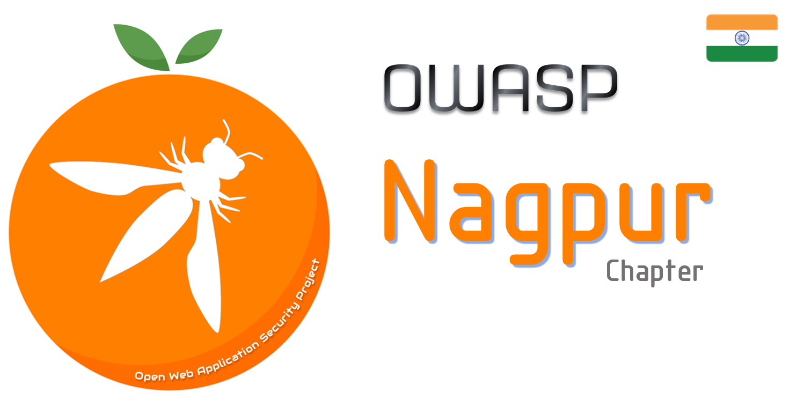

---

layout: col-sidebar
title: OWASP Nagpur
tags: nagpur 
level: 0
site_side: true
region: Asia
meetup-group: OWASP-Nagpur-Chapter
country: India
postal-code: 440001

---

  

## Welcome
Welcome to OWASP Nagpur Chapter.  

## Participation
The Open Worldwide Application Security Project (OWASP) is a nonprofit foundation that works to improve the security of software. All of our projects, tools, documents, forums, and chapters are free and open to anyone interested in improving application security. 

Chapters are led by local leaders in accordance with the [Chapter Policy](https://owasp.org/www-policy/). Financial contributions should only be made online using the authorized online donation button. To be a SPEAKER at ANY OWASP Chapter in the world simply review the [speaker agreement](https://owasp.org/www-policy/) and then contact the local chapter leader with details of what OWASP Project, independent research, or related software security topic you would like to present.

Everyone is welcome and encouraged to participate in our [Projects](/projects), [Local Chapters](/chapters), [Events](/events), [Online Groups](https://groups.google.com/a/owasp.com/), and [Community Slack Channel](https://owasp.slack.com/). We especially encourage diversity in all our initiatives. OWASP is a fantastic place to learn about application security, to network, and even to build your reputation as an expert. We also encourage you to be [become a member](/membership) or consider a [donation](/donate) to support our ongoing work.

## Upcoming Events

* Everyone is welcome to join us at our chapter meetings which are free to attend. Just come with an open mind and willingness to share and learn..



