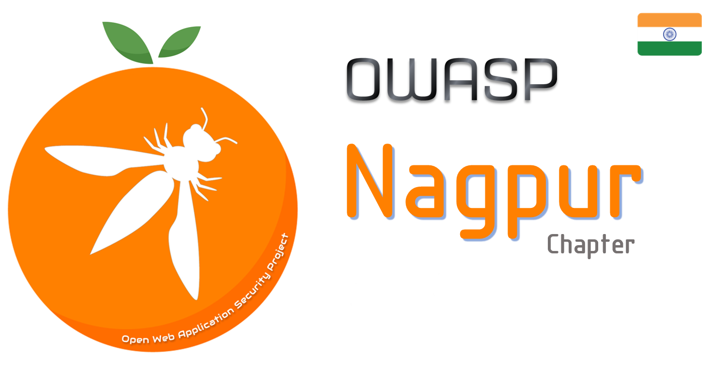

---

layout: col-sidebar
title: OWASP Nagpur
tags: nagpur
level: 0
site_side: true
region: Asia
meetup-group: OWASP-Nagpur-Chapter
country: India
postal-code: 440001

---

  

    
  

## Welcome

Welcome to the **OWASP Nagpur Chapter** — your local hub for application security knowledge, community, and collaboration in Nagpur, India.

We bring together security professionals, developers, researchers, and students to share knowledge, discuss the latest threats, and build a stronger, more secure software ecosystem. All our events are **free and open to everyone**.

Follow us on [LinkedIn](https://www.linkedin.com/company/owaspngp/) to stay updated on upcoming events, security insights, and community news.

## About Us

The OWASP Nagpur Chapter has been actively running local meetups, workshops, and collaborative sessions focused on application security. We cover topics ranging from OWASP Top 10 vulnerabilities, web and mobile security, DevSecOps, cloud security, and much more.

Interested in speaking? We welcome talks on OWASP projects, independent security research, or any related software security topic. Head over to the **Speakers** tab to learn how to submit your talk.

## Participation

The Open Worldwide Application Security Project (OWASP) is a nonprofit foundation that works to improve the security of software. All of our projects, tools, documents, forums, and chapters are free and open to anyone interested in improving application security.

Chapters are led by local leaders in accordance with the [Chapter Policy](https://owasp.org/www-policy/). Financial contributions should only be made online using the authorized online donation button. To be a SPEAKER at ANY OWASP Chapter in the world simply review the [speaker agreement](https://owasp.org/www-policy/) and then contact the local chapter leader with details of what OWASP Project, independent research, or related software security topic you would like to present.

Everyone is welcome and encouraged to participate in our [Projects](/projects), [Local Chapters](/chapters), [Events](/events), [Online Groups](https://groups.google.com/a/owasp.com/), and [Community Slack Channel](https://owasp.slack.com/). We especially encourage diversity in all our initiatives. OWASP is a fantastic place to learn about application security, to network, and even to build your reputation as an expert. We also encourage you to [become a member](/membership) or consider a [donation](/donate) to support our ongoing work.

## Upcoming Events

All our chapter meetings are free to attend.

