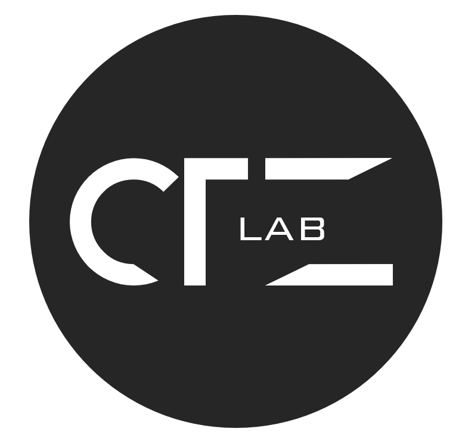

---

title: Sponsors
displaytext: Sponsors
layout: null
tab: true
order: 5
tags: nagpur

---

## Sponsors

OWASP Nagpur is a free, community-run chapter. Our sponsors help make events possible by providing venues, resources, and support. We are grateful for their continued partnership.

If your organisation is interested in sponsoring the OWASP Nagpur Chapter, please reach out to [aishwary.gathe@owasp.org](mailto:aishwary.gathe@owasp.org).

---

### Local Sponsors

  

    
    Persistent Systems
    Venue Sponsor
  

  

    
    CTZ Lab
    Community Sponsor
  

---

### Community Partners

We collaborate with local colleges and universities to bring application security awareness to students and academic communities in Nagpur.

  

    <h4>Your College / University</h4>
    
Partner institution — co-hosting events, student outreach, and security awareness programmes.

    <a href="#" target="_blank">Visit Website</a>
  

  Are you a college, university, or student group interested in partnering with OWASP Nagpur? Write to us at
  <a href="mailto:aishwary.gathe@owasp.org" style="color: #004a97;">aishwary.gathe@owasp.org</a>.

---

  <strong>Become a Sponsor</strong> 
  OWASP Nagpur welcomes organisations that share our commitment to software security. Sponsors receive recognition on this page, mentions at chapter events, and the opportunity to connect with the local security community.
  Contact us at <a href="mailto:aishwary.gathe@owasp.org" style="color: #004a97;">aishwary.gathe@owasp.org</a> to discuss sponsorship options.

